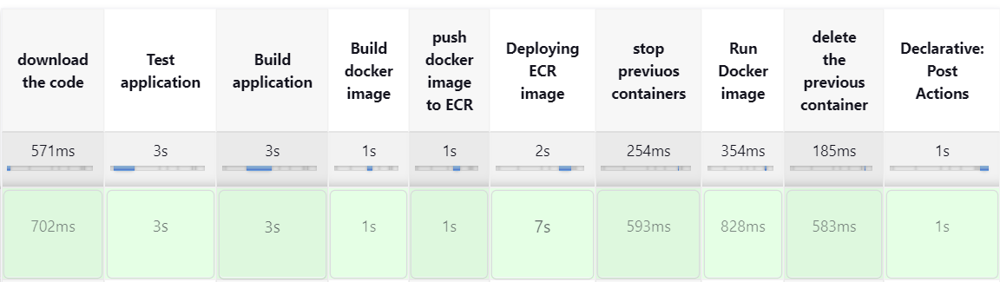

# Build CI / CD Pipeline using Jenkins and deploy the real world Web Application in AWS Cloud

Technologies Used:-
-------------------
1. Jenkins
2. Groovy
3. AWS Cloud
4. Git
5. Docker  

Pre-Requiset:
--------------
* Setup Jenkins (ubuntu with t2.large)
* Setup webhook integration for automatic Build Triggers 
* Create A Role (name: meen_new_role) with AmazonEC2ContainerRegistryFullAccess and attach to Jenkins machine  
* Create ECR Repository in the same region where jenkins machine is available to upload image into that repository

JenkinsFile Code steps
-------------------------------
>step1: To build pipeline code, we need to create an agent machine and include here to build the job from agent machine 
   
    pipeline
    {
        agent any
    }

>step2: To Pass environments in jenkins

    environment {
        APP_NAME = "mytomee"
        ECR_REGISTRY = "433609462612.dkr.ecr.eu-west-2.amazonaws.com"
        ECR_REPOSITORY = "myimagerepo"
        IMAGE_NAME = "${APP_NAME}"
        BUILD_VERSION = getVersion()
    }

>step3: Download the code from repository

        stage("Download Code")
        {
            steps
            {
                git 'https://github.com/meenashreyansh12/Project1.git'
            }
        }

>step4: Build and test application code using maven 

        stage("Test Application")
        {
            steps
            {
                    sh 'mvn test'
            }
        }
        stage("Build Application")
        {
            steps
            {
                sh 'mvn package'
            }
        }

>step5: Build the Docker image 
    
* First download Docker in Jenkins machine for building image from Dockerfile
       
        # sudo curl -fsSL https://get.docker.com -o install-docker.sh
        # sudo sh install-docker.sh

* Add jenkins user in docker group to build docker images directly 
        # sudo usermod -a -G docker jenkins
  
* Add jenkins user in sudo group to run root commands. Also, enter details of jenkins user in sudoers file to avoid asking for password [ jenkins ALL (ALL:ALL) NOPASSWD:ALL ]
       
        # sudo usermod -a -G sudo jenkins
        # vim /etc/sudoers
        
* To Build Docker image    
        
        stage("Build Docker image")
        {
            steps
            {
                 sh "docker build -t $APP_NAME:$BUILD_VERSION ."
            }
        }

>step6: To push Docker image into ECR repository 
* If Jenkins machine is avilable in AWS cloud environment, that machine need to contain a role with AmazonEC2ContainerRegistryFullAccess and attach to Jenkins 
  machine 
* If Jenkins machine is available in local environment, then that machine requires a user () with AdministrationAccess  
* Check if ECR repository is avialabile, and if it's not available then create the repository in AWS ECR service 
* There are a group of steps included below to push the existing docker image to ECR repository
* Below is the jenkins code to upload image into ECR repository 

        stage("Push docker image to ECR")
        {
            steps
            {
              script
              {
                    sh "aws ecr get-login-password --region us-east-1 | docker login --username AWS --password-stdin ${ECR_REGISTRY}"
                    sh "docker tag $APP_NAME:$BUILD_VERSION $ECR_REGISTRY/$ECR_REPOSITORY:$BUILD_VERSION"
                    sh "docker push $ECR_REGISTRY/$ECR_REPOSITORY:$BUILD_VERSION"
              }
            }
        }

>step7: Now pull the ECR image to local machine. For this, we need to login to ECR and deploy it into EC2 machine(Docker)

* Setup Docker machine (specify security group in the inbound rules. Open ssh 22 port to admin access only and specify customised port 9090 to anyone to access our webpage)
* Establish the password-less authentication from Jenkins machine to Docker machine 
* Add ubuntu user in docker group, to run the docker commands 
* For this we need to create a role with AmazonEC2ContainerRegistryFullAccess and attach it to the EC2-instance

* Authenticate to AWS ECR and install awscli and aws configure to create AccessKeys and SecretAccessKeys on IAM role for ECR permissions

        # aws ecr get-login-password --region us-east-1 | docker login --username AWS --password-stdin ${ECR_REGISTRY}"

* Pull image from ECR    

        # docker pull $ECR_REGISTRY/$ECR_REPOSITORY:$BUILD_VERSION

  stage("Deploying ECR image") 
        {
            steps
            { 
                script
                { 
                    sh 'ssh ubuntu@172.31.7.122 aws ecr get-login-password --region eu-west-2 | docker login --username AWS --password-stdin ${ECR_REGISTRY}'
                    sh 'ssh ubuntu@172.31.7.122 docker pull $ECR_REGISTRY/$ECR_REPOSITORY:$BUILD_VERSION'
                }
            }
        }

>step7: Stop previous containers(myappcontainer) 

        stage("stop previuos containers")
        {
            steps
            {
                sh 'ssh ubuntu@54.234.168.231 docker rm -f myappcontainer'
            }
        }

>step8: Now run the container 

        stage("Run Docker image")
        {
            steps
            {
                sh "ssh ubuntu@54.234.168.231 docker run --name myappcontainer -d -p 9090:8080 $ECR_REGISTRY/$ECR_REPOSITORY:$BUILD_VERSION"
            }
        }

>step9: Delete the container(myappcontainer) 

        stage("delete previuos container")
        {
            steps
            {
                sh 'ssh ubuntu@54.234.168.231 docker rm -f myappcontainer'
            }
        }

>step10: Setup to send Notification To gmail ( for this we need to setup smtp port in jenkins to particular gmail )

* according below steps if all steps gets success it will send project success message or if any step gets fail it will failed project
* To setup mail configuration in jenkins follw this link: https://drive.google.com/file/d/1G2HGfoGKyv3pzB1eLnW8mVxaUeltqpZ1/view?usp=drive_link
 

        post
        {
            success
            {
                mail bcc: '', body: 'ci-cd gets success', cc: '', from: '', replyTo: '', subject: 'Pojects completed successfully', to: 'meenpenu99@gmail.com'
                echo "Project completed Successfully"
            }
            failure
            {
                mail bcc: '', body: 'failed ci-cd', cc: '', from: '', replyTo: '', subject: 'Pojects Failed', to: 'meenpenu99@gmail.com'
                echo "Project Failed"
            }
        }

>step11: Specify the function to trigger build versions images 

        def getVersion()
        {
            def buildNumber = env.BUILD_NUMBER ?: '0'
            return "1.0.${buildNumber}"
        }

# All stages 

# Gmail Notification 

.png>)